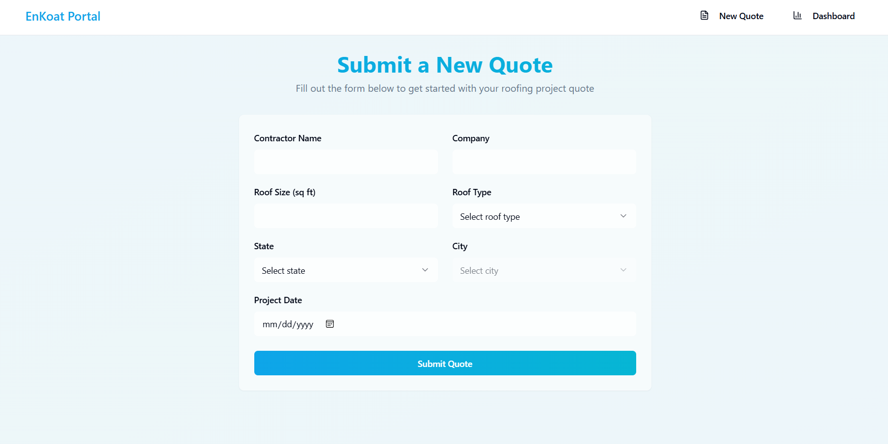
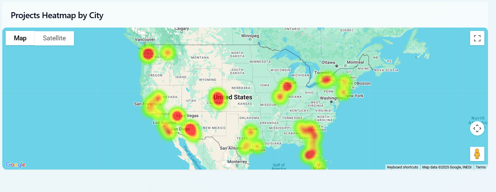

# EnKoat Quote Dashboard

## Summary
Welcome to the EnKoat Quote Dashboard! This is a user-friendly web application that helps track and visualize roofing projects across the United States. Think of it as your one-stop shop for all things related to roofing projects - from seeing where projects are happening on a map to understanding how much energy different types of roofs can save.

Getting started is super easy -
- Use our **simple quote form to add new roofing projects**. 
- The form lets you input all details like the contractor's name, company information, roof size, type of roof, City and state. Once you submit a project, it's automatically added to our dashboard and shows up in all the visualizations!

Want to know how many projects are happening in Phoenix? Or curious about which type of roof is most popular in Texas? Our dashboard makes it easy to find these answers with just a few clicks. You can explore projects through colorful charts and maps, and even download detailed reports for specific cities.

What makes this dashboard special is how it brings complex data to life in a way that's easy to understand. Whether you're a contractor looking to track your projects or a manager wanting to see the big picture of roofing installations across different states, we've got you covered!

### Core Features

#### Data Visualization & Analytics
- **Dynamic Dashboard**: Real-time display of key metrics including project counts, average roof sizes, and energy savings
- **Interactive Charts Suite**:
  - Bar charts showing distribution of roof types
  - Line charts tracking monthly project trends
  - Pie charts displaying average roof sizes by substrate
  - Interactive heatmap visualizing project density across different locations
- **Quote Management Form**: Streamlined form for adding new roofing projects with comprehensive data validation
- **Geographic Intelligence**: 
  - State and city-level filtering capabilities
  - Interactive Google Maps integration showing project distribution
- **City-Specific Analytics**: Detailed reports including:
  - Most commonly used roof types
  - Total project counts
  - Average roof dimensions
  - Estimated energy savings
- **PDF Report Generation**: Professional, downloadable reports of city insights.

## Technologies Used

### Frontend
- **React**: For building the user interface.
- **TypeScript**: For type safety and better developer experience.
- **Recharts**: For creating interactive charts and graphs.
- **Google Maps API**: For rendering the heatmap of project locations.
- **Tailwind CSS**: For styling the application.
- **html2pdf.js**: For generating PDF reports.
- **Vite**: For fast development and build tooling.

### Backend
- **Django**: For serving the API endpoints.
- **Django REST Framework**: For building RESTful APIs.
- **PostgreSQL**: As the database for storing project data.
- **Faker**: For generating mock data.

## Local Development Setup

### Prerequisites
- Node.js installed
- Python 3.13 installed

### Steps

#### Clone the Repository
1. Run the following command to clone the repository:

   ```bash
   git clone https://github.com/claguduv/Enkoat-Quote-Dashboard.git
   ```
#### Backend
- Open new terminal and run the following commands 

2. Navigate to the `backend` directory:
   ```bash
   cd backend
   ```
   - Terminal should look like ""../enkoat-quote-dashboard/backend"

3. Create a virtual environment and activate it:
   ```bash
   python -m venv enkoatenv
   ```
   ```bash
   enkoatenv\Scripts\activate.bat  # On Windows command prompt

   .\enkoatenv\Scripts\Activate.ps1    # On Windows powershell

   source enkoatenv/bin/activate # On macOS/ Linux
   ```
4. Install dependencies:
   ```bash
   pip install -r requirements.txt
   ```

5. Start the development server:
   ```bash
   python manage.py runserver
   ```

#### Frontend
- Open new terminal and run the following commands 

6. Navigate to the `frontend` directory:
   ```bash
   cd frontend
   ```
   - Terminal should look like ""../enkoat-quote-dashboard/frontend"

7. Install dependencies:
   ```bash
   npm install
   ```
8. Start the development server:
   ```bash
   npm run dev
   ```
9. Open the application in your browser at `http://localhost:8080`.

**NOTE:**

**- In Quote form if the data is not submitted the first time - refresh the page once as the database is connected to my local postgres.**

**- In Dashboard if the heatmap is not visible over the map - refresh the page once as the google heatmap api is called over the map.**

## Mock Data Implementation

### Data Generation Strategy
The project includes a sophisticated mock data generation system implemented using Python's Faker library. The data generation process is designed to create realistic and consistent roofing project data that mimics real-world scenarios.

### Generated Data Fields
- **Contractor Information**: Realistic contractor names and company details
- **Project Specifications**: 
  - Varied roof sizes (500-50,000 sq ft)
  - Multiple roof types (METAL, TPO, FOAM, etc.)
  - Realistic project dates
- **Geographical Distribution**: 
  - Data spread across multiple states and cities
  - Coordinates for heatmap visualization
- **Energy Efficiency Data**: Calculated savings based on roof types

### Usage
- The mock data system is implemented in `mock_data/generate_mock_data.py`.
- The mock_quotes.csv is the data generated


## Future Enhancements

### 1.  EnKoat Assistant (AI Chat Support)
Like having a knowledgeable friend available 24/7! This would:
- Answer common questions instantly
- Help with basic troubleshooting
- Guide users through the quote process
- Provide maintenance tips and reminders

Perfect for getting quick answers without waiting for business hours!

### 2. Success Stories & Energy Savings Showcase
A powerful marketing tool that builds trust through real results:
- Interactive before/after project galleries
- Real-time energy savings trackers
- Customer testimonials with verified savings data
- Shareable success stories for social media
- Environmental impact metrics

Why it matters: Nothing sells better than proven results. This feature turns happy customers into brand ambassadors and provides compelling content for marketing.

### 3. Contractor Marketplace & Review Platform
Create a thriving ecosystem that brings in both contractors and property owners:
- Verified contractor profiles with performance metrics
- Customer reviews and ratings
- Project bidding system
- Automated contractor matching
- Success rate tracking

Why it matters: Builds trust, creates a network effect, and positions EnKoat as the go-to platform for roofing projects.

### 4. Mobile App with Real-Time Project Tracking
Keep customers engaged and informed throughout their project:
- Live project status updates with photos
- Real-time communication platform
- Weather-aware scheduling
- Push notifications for important updates
- Digital document signing

Why it matters: Improves customer satisfaction, reduces support calls, and creates a modern, professional image for the company.

### 5. AI-Powered ROI & Environmental Impact Calculator
Help customers understand the value proposition instantly:
- Customized savings calculations based on location and building type
- Energy bill reduction estimates
- Carbon footprint impact visualization
- Available tax incentives and rebates
- Comparative analysis with traditional roofing

Why it matters: Makes the benefits of choosing EnKoat crystal clear, helping to justify the investment and close more sales.

Each of these features is designed to either bring in new customers, improve conversion rates, or encourage word-of-mouth marketing. They work together to create a powerful growth engine for EnKoat while providing real value to customers.

## Technical Future Enhancement

#### 1. Enhanced Security Implementation

**User Authentication & Authorization**
- Multi-factor authentication (SMS/Email verification)
- Role-based access control (Admin, Contractor, Property Owner)
- Session management with automatic timeouts
- Password strength requirements and regular renewal policies

**Data Protection**
- End-to-end encryption for sensitive data
- Regular automated backup systems
- GDPR and data privacy compliance
- Secure file upload handling
- API rate limiting to prevent abuse

#### 2. Comprehensive Testing Strategy

**Frontend Testing**
- Unit tests for React components using Jest
- Integration tests with React Testing Library

**Backend Testing**
- Django unit tests for models and views
- API endpoint testing
- Database transaction testing
- Load testing for high-traffic scenarios

**Automated Testing Pipeline**
- Continuous Integration/Continuous Deployment (CI/CD)
- Automated test runs on every pull request
- Code coverage reporting
- Performance benchmarking
- Automated accessibility checks

#### 4. Code Quality & Maintenance

**Code Standards**
- Comprehensive technical documentation with api request and response
- Regular dependency updates

**Monitoring & Logging**
- Error tracking system
- Performance monitoring
- User behavior analytics
- Automated alert systems

#### 5. DevOps & Deployment

**Infrastructure as Code**
- Docker containerization
- Kubernetes orchestration
- Automated scaling

## Sample Screenshots of the project

### Quote Form


### Performance Dashboard 


### Filter Number of projects by State and City


### Average Roof Size built till now 


### Energy saving by filtering roof type


### Number of Projects by month - Line chart


### Count of projects done by each roof type - Bar chart


### Average roof size built by substrate - Pie chart


### Insight of each city - with city filter


### Table of projects based on each city - With download PDF option


### Count of projects done in each city - Heatmap

